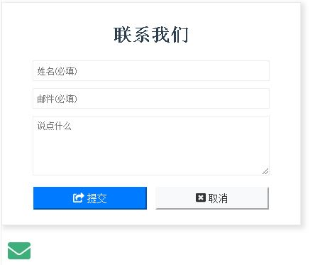

# Vuepress Plugin: Contact Us Form

This plugin will automatically put a floating button at the left-bottom corner, once it's clicked, a contact us form will be popped up for you.

* You could set your own Email Delivery API URL
* You could use the user's default email client to send contact-us data
* This plugin integrated the font awesome icon into the UI
* This plugin support English and Chinese

> Demo Screenshot



> Please refer the `Options` section below.

## Install
### Yarn (Recommanded)
```bash
yarn add vuepress-plugin-contact-us
```
### NPM
```bash
npm install vuepress-plugin-contact-us@latest
```

## Options
You could config this plugin with `.vuepress/config.js`:
```javascript
module.exports = {
    plugins:[
        [
            'contact-us', // Or 'vuepress-plugin-contact-us'
            {
                /**
                 * Mandatory: the email address which the contact data will be sent
                 */
                email: 'hi@yue.dev',
                /**
                 * Optional: Language, by default is 'en' (English)
                 */
                labelLanguage: 'cn',
                /**
                 * Optional: Your custom API URL, by default: null (Use user's email client such as Outlook)
                 */
                emailSenderApi: 'https://api/your-domain.com/contact-us-handler'
            }
        ]
    ]
}
```

## How to send email
### If you have your own API to send email
#### Request
> Once the user submits the contact form and all fields are valid, the data will be sent to the API url by POST method, with following format:
```json
{
    "email": "foo@bar.com",
    "fullname": "John Doe",
    "message": "This is my message body"
}
```

#### Response
> Once the HTTP request is handled, we expect the response will be returned as following format in JSON:
```json
{
    "error_no": 100,
    "message": "Thanks, you will be in touch very soon"
}
```

Name | Type | Description/Meaning
---------|----------|---------
error_no | int | 100: means success; Any other value: means failed
message | String | Text message you want the user to see

Example(In PHP):
```php
// ... handle the HTTP request, send email or put into a job queue ...

if($everythingGoesWell){
    // In case of success
    $result = [
        'error_no' => 100,
        'message'  => 'Thanks, you will be in touch very soon!'
    ];
}
else{
    $result = [
        'error_no' => 99,   // Something goes wrong
        'message'  => 'Sorry we are out of service now!'
    ];
}

// Send result to server
echo json_encode($result);
```

### If you DON'T have your own API, by default, the plugin will try to use the user's default email client such as Outlook.

## Changelog

## Thanks